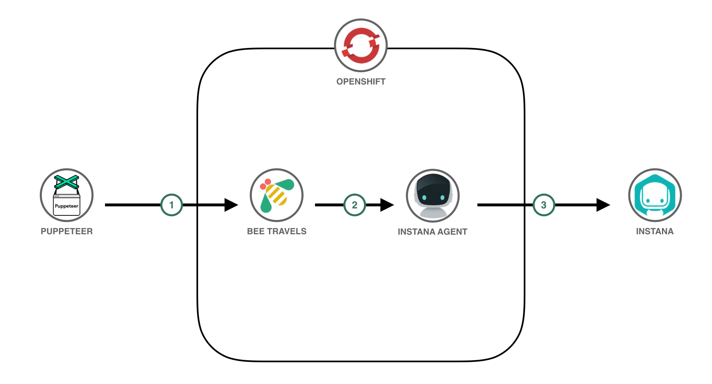
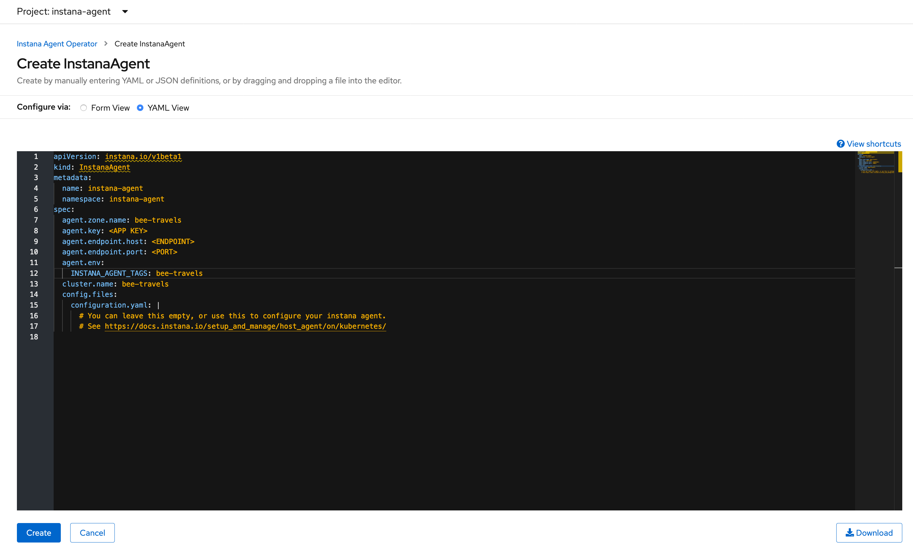
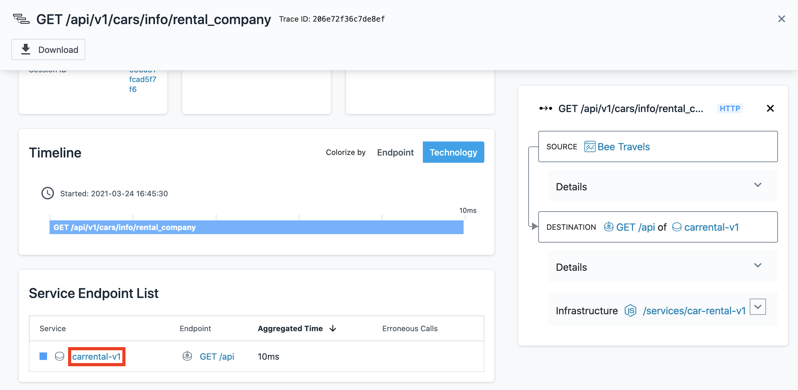

# Integre o Instana com uma Aplicação Microsserviço no OpenShift

https://developer.ibm.com/patterns/integrating-instana-with-microservice-app-on-openshift/

Neste code pattern, vamos integrar o [Instana](https://www.instana.com/) com uma aplicação de microsserviço de viagem no OpenShift. Instana é uma solução automatizada de Observação Enterprise, com monitoramento de infraestrutura e Gerenciamento de Performance da Aplicação - Application Performance Management (APM), desenhada especificamente para os desafios de gerenciamento de microsserviços e aplicações cloud native.

Geraremos tráfego para a aplicação usando o [Puppeteer](https://developers.google.com/web/tools/puppeteer/) e analisaremos o mesmo tráfego com o dashboard/painel de controle do Instana. A aplicação de viagem que será usada neste code pattern fará parte do projeto [Bee Travels](https://bee-travels.github.io/), que foca em algumas versões iniciais dos serviços da aplicação. Os serviços utilizados neste code pattern são:
* Destination v1 (Node.js)
* Car Rental v1 (Node.js)
* Hotel v1 (Python)
* Currency Exchange (Node.js)
* UI (Node.js/React)

# Arquitetura



1. O script Puppeteer gera tráfego para a aplicação Bee Travels rodar em seu cluster OpenShift.
2. O código do Instana, em cada serviço da aplicação Bee Travels, envia dados sobre o serviço no cluster OpenShift (um agente Instana para cada nó do cluster).

# Passos

- [Integre o Instana com uma Aplicação Microsserviço no OpenShift](#integre-o-instana-com-uma-aplicação-microsserviço-no-openshift)
- [Arquitetura](#arquitetura)
- [Passos](#passos)
  - [1. Pré-Requisitos](#1-pré-requisitos)
  - [2. Faça um fork do repositório](#2-faça-um-fork-do-repositório)
  - [3. Integre o Instana](#3-integre-o-instana)
  - [4. Implementar no OpenShift](#4-implementar-no-openshift)
  - [5. Gere Tráfego e Analise com Instana](#5-gere-tráfego-e-analise-com-instana)
- [Licença](#licença)

## 1. Pré-Requisitos

* [Conta IBM Cloud](https://cloud.ibm.com/registration)
* [OpenShift CLI (oc)](https://cloud.ibm.com/docs/openshift?topic=openshift-openshift-cli#cli_oc)
* [Docker](https://www.docker.com/products/docker-desktop)
* [NodeJS](https://nodejs.org/en/download/)
* [NPM](https://www.npmjs.com/get-npm)
* [Yarn](https://classic.yarnpkg.com/en/docs/install)
* [Puppeteer](https://developers.google.com/web/tools/puppeteer/get-started)
* [Acesse o Instana](https://www.instana.com/trial/)

## 2. Faça um fork do repositório

1. Vá ao topo da página do repositório e clique no botão de **Fork**.

2. Selecione a conta da lista que você gostaria de realizar o Fork do repositório.

## 3. Integre o Instana

Uma vez que você tem acesso ao Instana, abra o painel de controle. Pressione  `Add Website` e adicione um nome ao seu website, por exemplo: `Bee Travels`


Copie o script gerado e insira a tag `<head>` em [/src/services/ui/frontend/public/index.html](src/services/ui/frontend/public/index.html). Isso irá integrar o Instana ao front end (UI) da sua aplicação. Permitindo que você analise os carregamentos da página, do tráfego e outros detalhes.

O Instana já é integrado ao serviço. Porém, para aprender como incorporá-lo nas aplicações [Node.js](https://www.instana.com/docs/ecosystem/node-js/configuration/) e [Python](https://www.instana.com/docs/ecosystem/python/configuration/), também em [outras tecnologias](https://www.instana.com/docs/ecosystem/), mais detalhes são oferecidos nas documentações hiperlinkadas.

Ter o Instana, em serviços backend, permite analisar traços distribuídos, telemetria e outras informações sobre chamadas diretas. Além disso, você pode examinar chamadas individuais e rastreá-las para mostrar como os serviços se comunicam um com o outro. Você ainda pode visualizar como o Instana é integrado em cada serviço Bee Travels abaixo:

**Serviço de Destino**
* Source code: [src/services/destination-v1/src/app.js](src/services/destination-v1/src/app.js) (linhas 14-17)
* Implementação yaml: [config/destination-v1-deploy.yaml](config/destination-v1-deploy.yaml) (linhas 53-64)

**Serviço de Aluguel de Carro**
* Source code: [src/services/car-rental-v1/src/app.js](src/services/car-rental-v1/src/app.js) (linhas 15-18)
* Implementação yaml: [config/carrental-v1-deploy.yaml](config/carrental-v1-deploy.yaml) (linhas 53-64)

**Serviço de Hotel**
* Source code: [src/services/hotel-v1-python/app/\__init__.py](src/services/hotel-v1-python/app/__init__.py) (linhas 11-12, 28)
* Implementação yaml: [config/hotel-v1-python-deploy.yaml](config/hotel-v1-python-deploy.yaml) (linhas 53-64)

**Serviço de Câmbio**
* Source code: [src/services/currency-exchange/src/app.js](src/services/currency-exchange/src/app.js) (linhas 14-17)
* Implementação yaml: [config/currencyexchange-deploy.yaml](config/currencyexchange-deploy.yaml) (linhas 51-62)

Agora que o Instana foi totalmente incorporado ao código, podemos pegar as credenciais para implementar um agente Instana. Para fazer isso, entre no painel de controle do Instana e clique em `Deploy Agent`.


Depois, selecione `OpenShift` na plataforma e `Operator` como tecnologia. Também copie o `Instana Service Endpoint`, `Instana Service port` e `Instana Application Key`. Essas informações serão necessárias quando implementarmos o agente Instana no cluster OpenShift.


## 4. Implementar no OpenShift

1. Provisione um [Cluster OpenShift](https://cloud.ibm.com/kubernetes/catalog/create?platformType=openshift).
> NOTA: Este passo pode levar aproximadamente 30 minutos.

2. Abra o console OpenShift. Copie e cole o seu login comando (`oc login...`) em uma janela do terminal.


3. Em uma janela do terminal, rode o script `build-and-deploy.sh` para realizar o build da aplicação Bee Travels e implementá-la no seu cluster OpenShift.
> NOTA: Este passo pode levar alguns minutos.

```
cd instana-openshift
./build-and-deploy.sh -d <DOCKERHUB_USERNAME>
```

Uma vez finalizado o script, você pode verificar os serviços da aplicação rodando no cluster OpenShift. Para isso, vá até `Workloads` -> `Pods` no seu console OpenShift. Também verifique se você está com o novo projeto “bee-travels”. Você deve observar o seguinte:


4. Agora que os serviços da sua aplicação estão implementados no seu cluster OpenShift, exponha a UI usando a rota. No seu console OpenShift, vá até `Networking` -> `Routes` e pressione o botão `Create Route`.


Após, preencha os campos da rota conforme a imagem a seguir — e então crie a rota.


ATENÇÃO: Lembre-se de que a localização/url, da nova rota criada, será usada posteriormente.

5. O passo final do cluster OpenShift é instalar o Instana Agent Operator, através do OperatorHub. Por isso, primeiramente, crie o projeto para o agente Instana e configure as permissões. No seu terminal rode, os seguintes comandos:

```
oc new-project instana-agent
oc adm policy add-scc-to-user privileged -z instana-agent
```

Depois, vá até `Operators` -> `OperatorHub` no seu cluster OpenShift e procure por Instana Agent Operator. Verifique o seu novo projeto `instana-agent`. Instale o operador.


Uma vez instalado, crie uma instância do Instana Agent.


Faça a configuração `YAML view` e edite o arquivo YAML. Ele deverá ficar igual ao da figura. E aqui, vamos incorporar as credenciais do Instana, copiadas no passo anterior.

`<APP KEY>` refere-se à `Instana Application Key`, `<ENDPOINT>` refere-se à `Instana Service Endpoint`, e `<PORT>` refere-se à `Instana Service port`. Posto que arquivo YAML está propriamente configurado, crie a instância do Instana Agent.



## 5. Gere Tráfego e Análise com Instana

Neste ponto, você notará que o painel de controle do Instana está recebendo informações do seu cluster OpenShift. Por isso, é hora de começar a gerar tráfego para a aplicação Bee Travels, que está rodando no cluster. Assim, iremos empregar um script que usa [Puppeteer](https://developers.google.com/web/tools/puppeteer/).
No seu terminal, rode os seguintes comandos para gerar tráfego:

```
cd traffic
npm install
node traffic.js <NUM_CALLS> <ROUTE>
```

`NUM_CALLS` - refere-se ao número de chamadas que serão feitas à sua aplicação Bee Travels. Cada chamada fará duas requisições à sua aplicação. A primeira está procurando por hotéis em uma cidade aleatória, a segunda por aluguéis de carro.

`ROUTE` - refere-se à localização/url da rota criada, a partir do seu OpenShift. Certifique-se de que não tenha  `/`

Terminando de rodar o script do tráfego, vá ao painel de controle do Instana e clique no seu site Bee Travels, para assim visualizar o tráfego. Porém, se você não conseguir verificá-lo, atualize o intervalo de tempo de visualização, que está localizado no canto superior direito.
Agora, visualizando o tráfego, pressione `Analyze Page Loads` para, com isso, observar as chamadas individuais feitas ao UI front end.


Adiante, você poderá visualizar as chamadas feitas pelo UI front end. Portanto, selecione uma, coloque no caminho, para analisar o percurso individualmente.


Visualizando a chamada, desça a página e verifique a atividade de XHR. Você notará que algumas requisições possuem o botão  `View Backend Trace`. Assim, clicando no botão, aparecerá uma requisição para rastrear o backend do serviço Bee Travels, que será chamado pela API do UI front end.


Enquanto visualizar o rastreio, você pode clicar no serviço `Service Endpoint List`, para analisar o serviço do backend no Instana.



Por fim, isso é o que este code pattern aborda sobre como analisar o tráfego do Bee Travels no Instana. Porém, sinta-se à vontade para verificar outros assuntos que o Instana oferece.

# Licença

Este code pattern tem a Licença Apache, Versão 2. Objetos de código de terceiros, invocados dentro deste code pattern, são licenciados pelos seus respectivos provedores, nos termos de suas próprias licenças. As contribuições estão sujeitas ao [Developer Certificate of Origin, Versão 1.1](https://developercertificate.org/) e ao [Apache License, Versão 2](https://www.apache.org/licenses/LICENSE-2.0.txt). Porém, caso tenha alguma dúvida, consulte o [Apache License FAQ](https://www.apache.org/foundation/license-faq.html#WhatDoesItMEAN).
